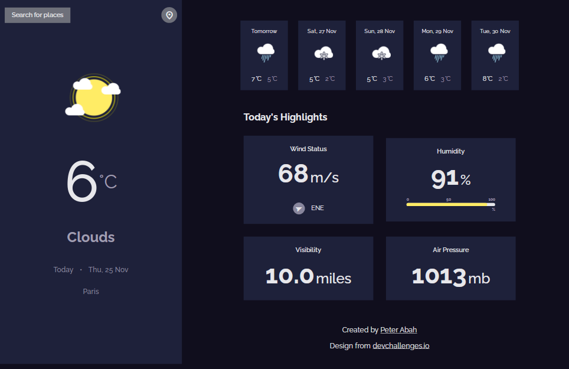
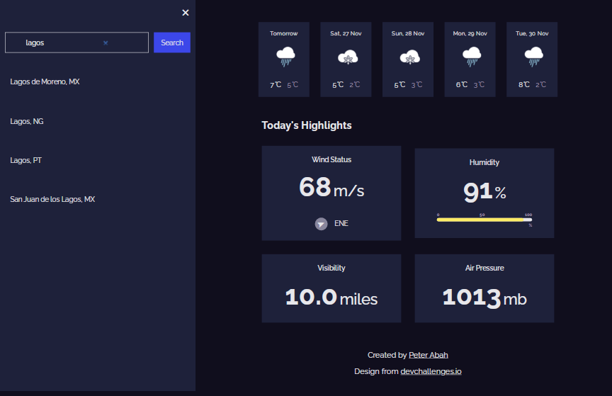
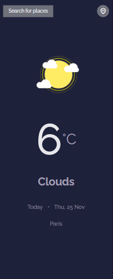
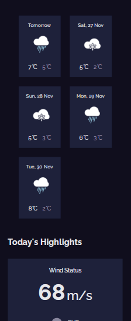
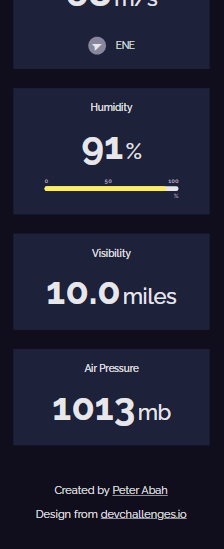

# Weather App
A web app to get the weather at your current location and also find the weather at any city in the world.

[Live Preview](https://peter-abah.github.io/weather-app)

## Table of Contents

- [Overview](#overview)
  - [Built With](#built-with)
  - [Screenshots](#screenshots)
- [Features](#features)
- [Acknowledgements](#acknowledgements)

## Overview
This project was done as part of [The Odin Project Curriculum](https://theodinproject.com).
This purpose of the project was to practice working with APIs and using async and await with promises.

### Built With

- HTML
- CSS
- JavaScript
- Webpack

## Features

- User can find the weather at their current location.
- User can search for any city in the world and find the weather at the particular city.
- User can view weather forecast for five days.

## Screenshots
# Desktop

# Mobile

## Acknowledgements

- Project Inspiration gotten from [The Odin Project](https://theodinproject.com)
- Weather api from [Open weather map api](https://openweathermap.org/api)
- Design from [devChallenges.io](https://devchallenges.io)